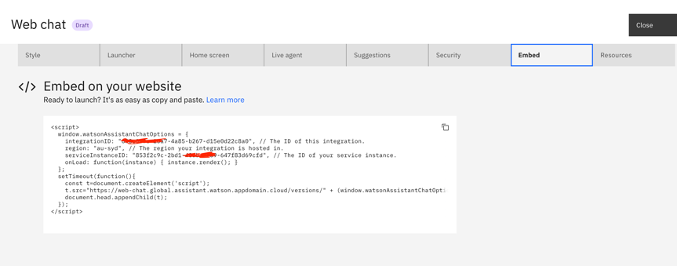
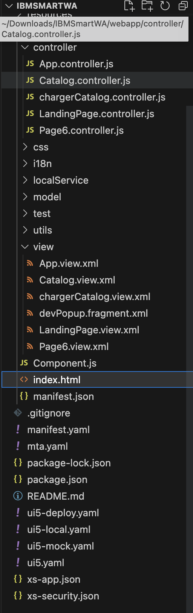
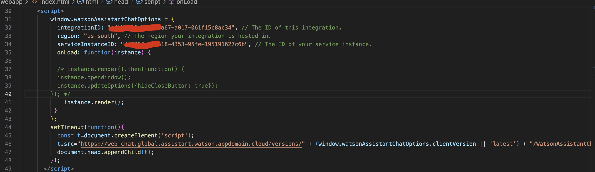
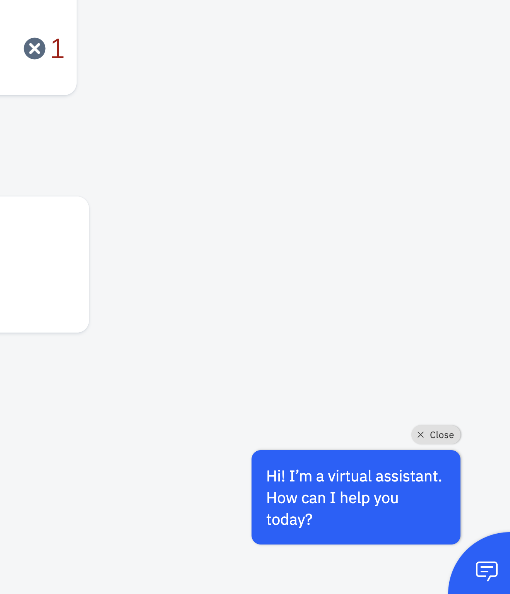
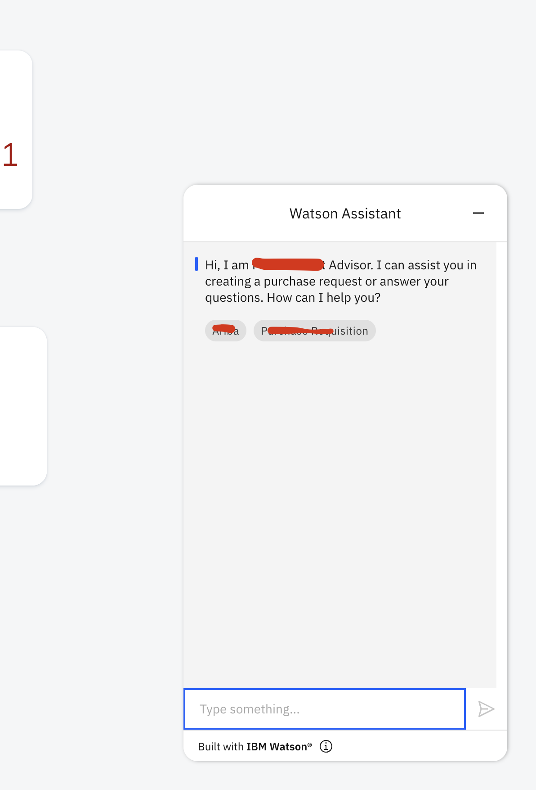

# Seamless Integration: Empowering Web Applications with IBM Watson Assistant 
- By [Ankit Guria](https://w3.ibm.com/#/people/003Z1Y744) Technology Engineer, IBM Ecosystem Engineering, Blue Partners Lab

In this tutorial, we will show how to add IBM Watson Assistant to multiple web applications and the steps on how to integrate our Watson Assistant using IBM Cloud to any web application. In this comprehensive detailed tutorial, we will show how to seamlessly integrate Watson Assistant into multiple web applications, using the powerful capabilities of IBM Cloud. You’ll see how Watson Assistant, enables not only developers but also  data scientists to directly integrate the Chatbot into the UI HTML of web applications, making it a versatile tool for enhancing user experiences.

As a data scientist cannot directly integrate Watson Assistant chatbot directly into the UI frontend of the web applications, it is essential that the Watson Assistant Embedded configuration is done before building the Chatbot.With the help of Watson Assistant on IBM Cloud or Watson Studio on IBM Cloud, you can easily connect the built Watson Assistant Chatbot service into a website or a browser-dependent web applications or mobile applications, analyse the data, and enhance the data according to the user/business requirements.

# Learning Objectives

When you have completed this tutorial, you will understand how to: 
- Add Watson Assistant to a SAP UI5/Fiori application
- Add Watson Assistant to a JavaScript Web application 
- Save the Watson Assistant chatbot to IBM Cloud 

# Prerequisite

- An IBM Watson Assistant Service instance [IBM Watson Service on IBM Cloud](https://cloud.ibm.com/services/conversation/crn%3Av1%3Abluemix%3Apublic%3Aconversation%3Aau-syd%3Aa%2F4f0e977785d64ddaa9c00744d09d4ae5%3A853f2c9c-2bd1-48db-a259-647f83d69cfd%3A%3A?paneId=manage). 
- [SAP BTP Account](https://accounts.sap.com/saml2/idp/sso?sp=cockpit-cf-eu10&RelayState=response_type%3Dcode%26scope%3Dopenid%26redirect_uri%3Dhttps%253A%252F%252Femea.cockpit.btp.cloud.sap%252Flogin%252Fcallback%26client_id%3D28f1d77a-ce0d-401a-b926-e393cd8ed4fa%26state%3D11346716447162)- If you prefer to deploy on SAP BTP HANA Cloud. 
- [Microsoft Visual Studio Code](https://code.visualstudio.com/download) as the Integrated Development Environment(IDE). 
- [SAP Business Application Studio](https://accounts.sap.com/saml2/idp/sso?sp=cockpit-cf-eu10&RelayState=response_type%3Dcode%26scope%3Dopenid%26redirect_uri%3Dhttps%253A%252F%252Femea.cockpit.btp.cloud.sap%252Flogin%252Fcallback%26client_id%3D28f1d77a-ce0d-401a-b926-e393cd8ed4fa%26state%3D11346716447162) (recommended) if deploying to SAP BTP HANA Cloud. 

# Estimated Time

Completing this tutorial should take about 10 minutes. 

# Steps 

Following this tutorial, you can deploy the Watson Assistant Chatbot on any of the web dependent applications. 
Steps to integrate Watson Assistant Chatbot on Web Applications or SAPUI5/Fiori Applications: 
# Step 1: Create an IBM Watson Assistant Service instance with the steps as follows: 
- Go to the IBM Cloud website (cloud.ibm.com) and sign into your account. 
- Create a new Watson Assistant service instance or use an existing one. 
- Make note of the credentials or API key that allows you to access the service. 
- Copy the embedded part of the Watson Assistant:  

# Step 2: Loading the Structure of the SAPUI5 application 

- The following is the architecture of a SAP UI5 application, we are using VS code for the development purpose, we can use other IDEs as well as per our requirement. 

**Note**: The above is an SAP UI5/Fiori application project architecture. We are supposed to play around the “Index.html” file of the application. 

# Step 3: Adding Embed part to the Project of SAPUI5 Application 

- We need to embedded part of IBM Watson Assistant Service to “Index.html” file. 
- Adding the copied part from Step 1 to the <script> tag of Index.html (Line 30 to Line 49). 

# Step 4: Testing the Chatbot and checking the UI 
- Now we need to run our application and the Watson Assistant is now available at the bottom right corner of the screen to answer your queries. 

**NOTE**: And the above 4 steps can get Watson Assistant Chatbot ready in any SAP UI5/Fiori application. 

# Summary 
- A crucial aspect emphasized in this tutorial is the configuration of the Watson Assistant Embed. Properly setting up and configuring the Embed feature ensures optimal functionality and alignment with web application requirements. By following the provided instructions, users will discover a straightforward approach to seamlessly connect the Watson Assistant Chatbot service to various platforms, including websites, web applications, and mobile applications. 
Leveraging the capabilities of IBM Cloud, specifically IBM Watson Assistant on IBM Cloud or Watson Studio on IBM Cloud, the integration process becomes more efficient. These robust cloud-based tools empower users to analyze and enhance data according to their specific needs and preferences. By utilizing Watson Assistant on IBM Cloud, users can tap into the power of natural language understanding and machine learning, enabling intelligent and context-aware conversations with the Chatbot. Customization and training options further allow for accurate and tailored responses. 

- This tutorial serves as a comprehensive guide for data scientists and developers, providing the necessary steps to integrate IBM Watson Assistant seamlessly. By leveraging the capabilities of IBM Cloud, users can enhance their web applications with intelligent conversational agents, delivering exceptional user experiences and valuable insights derived from user interactions. 

# Next Steps

As next steps, this project can now be used as a base to build and add more features on top of it to create chatbots for different use cases.
Watson Assistant Documentation:

https://cloud.ibm.com/docs/assistant?topic=assistant-getting-started

